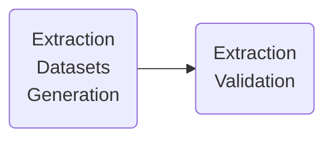
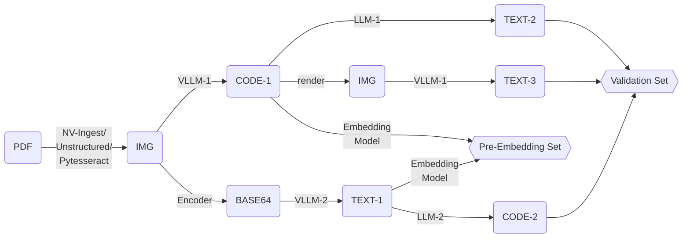
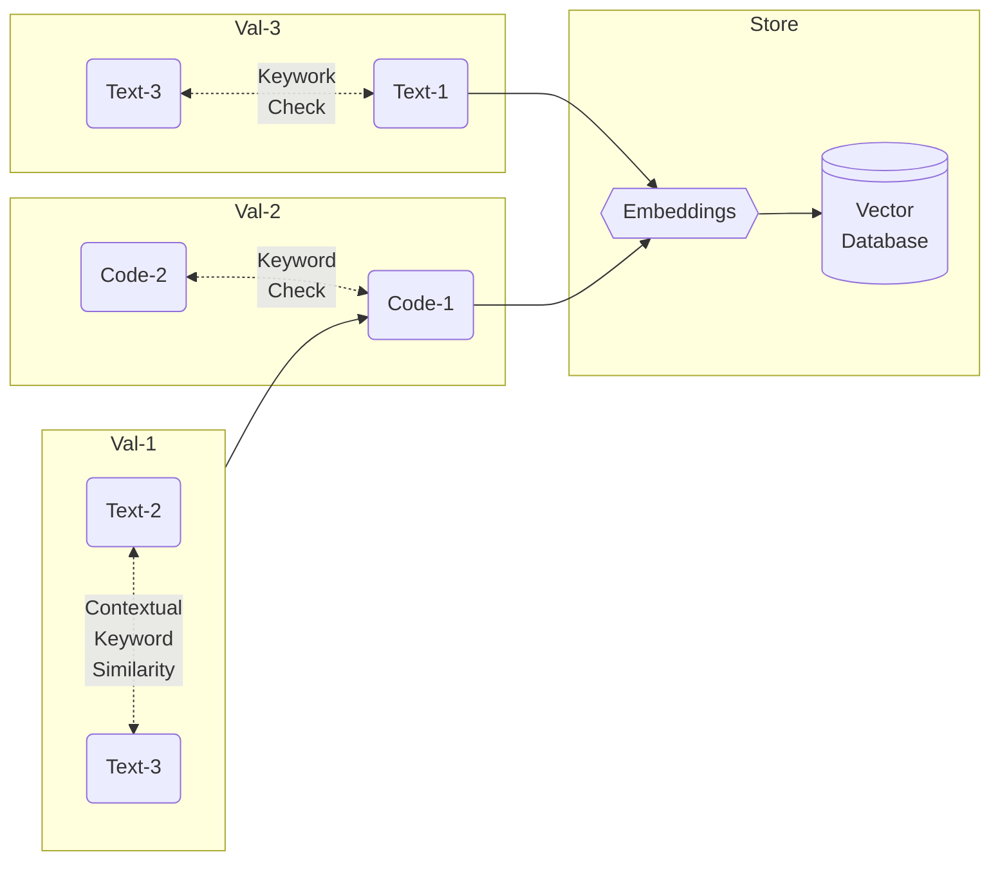

# PDF Image Ingestion

## Version

This project is still in development, see the latest branch: **202504-rc1**

## Summary

Image to Pre-Embedding Dataset by generation & validation pre-steps.

#### Image Extraction Workflow

#### Image Extraction Pre-Validation Datasets Generation

#### Pre-Validation Datasets Distributions

- Pre-Embedding dataset:
  - Code-1: VLLM-1
  - Text-1: VLLM-2
- Validation Set Store:
  - Code-2: LLM-2
  - Text-2: LLM-1
  - Text-3: VLLM-1

#### PDF Image Extraction Validation Flow

#### Validation Explained

- Val-1: Represents the quality of Code-1 
- Val-2: Validates the quality of Code-1 
- Val-3: Validates the quality of Text-1 

**Contextual Keyword Similarity** please refer to GitHub: **[domain-specific-llm-eval](https://github.com/iiyyll01lin/domain-specific-llm-eval)**

#### Image Extraction Pre-Embedding Dataset Schema

- image_metadata
  - image_id
  - page_num
  - source_metadata
  - ... TBD
- content_code: Code-1
- content_description: Text-1
- content_base64: debug
